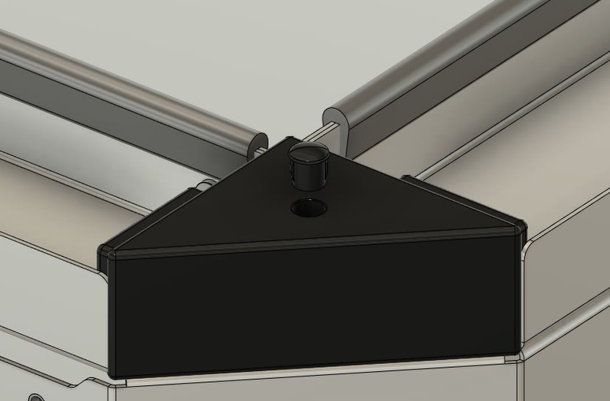

# T-Arm Full Assembly

## Video



## Required Parts

BOMMER List will go here

## Procedure

1. Gather the Welded Torsion Arm Assembly and the Torsion Box Assembly.
2. Insert the end of the axle that has the circular plates into the Welded Torsion Arm as shown in the _Axle insertion and attachment_ chapter of the video.
3.  Use an m2.5 Allen wrench to fasten the inner and outer sets of screws in the Torsion Arm. \

    <figure><figcaption>
Make use of the oval cutout to reach for the bottom-left inner screw, as shown below. 
</figcaption></figure>
4.  Now, gather the Motor Controller Housing and assemble it to the axle as shown next.\

    <figure><figcaption>
Please note the bosses' portion of the enclosure might come with the grommet facing a different direction.
</figcaption></figure>
5.  Take the U-Bolts and the clamps and insert the first into the latter making sure that the flat portion of the clamps is facing the bolts, as shown below.\

    <figure><figcaption>
Detail showing the U-Bolts sub-assembly.
</figcaption></figure>
6. Insert the U-Bolts into the Torsion Arm and set them in the mounting holes, but do not fasten them yet.
7.  Grab the BLDC Hub Motor and insert it into the torsion arm, making sure the wiring goes first and through the U-Bolts.\

    <figure><figcaption>
There are electrical control wires for the motor phases and the hall effect sensors that need to be carefully managed during this assembly process.
</figcaption></figure>
8.  Route the wiring through the axle access hole as shown below.\

    <figure><figcaption>
The grommet in the ESC enclosure protects the wiring from scrapping against the sharp edges of the axle.
</figcaption></figure>
9.  Tighten the U-Bolts against the the shaft of the motor hub. Then take the 4 nuts and secure the assembly wheel in place.\

    <figure><figcaption>
Close-up to the hex nuts being tightened underneath the torsion arm. 
</figcaption></figure>
10. Pick up the front plastic cover and clip it into place. Then secure it using two M5 screws at the top and one M3 screw at the sides.\

    <figure><figcaption>
Securing the front plastic cover.
</figcaption></figure>
11. At last, grab the back plastic cover, clip it into the assembly and secure it using 4 M3 screws.\

    <figure><figcaption>
The rear plastic cover offers an extra layer protection to the electronics and wiring inside of the torsion arm.
</figcaption></figure>


## Assembly notes

* Assembling the U-Bolts with the clamps in the correct orientation, and **very lightly** screwing them in place first seems to the best procedure.&#x20;
* Work one U-Bolt at a time. The shaft is then pushed in through the first clamp. Some downward pressure will prevent the U-Bolt from jostling out of place.
  * You may need to loosen the nuts even more or remove one entirely to let the fully round part of the axle end past the U-bolt.&#x20;
  * once past the fully round section, rotate the Axle so the flat part is aligned with the flat part of the clamp. You may tighten the nuts slightly at this point.
  * Push the axle in further and repeat with the second U-bolt.


